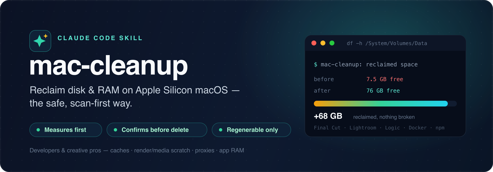

<p align="center">
  
</p>

<h1 align="center">claude-mac-cleanup</h1>

<p align="center">
  A <b>Claude Code skill</b> that safely reclaims <b>disk space and RAM</b> on Apple&nbsp;Silicon macOS —
  scan&#8209;first, and it always asks before deleting anything.
</p>

<p align="center">
  
  
  
  
</p>

---

## What it does

Macs quietly fill up with regenerable junk — build caches, render/media caches, old toolchain
versions, emulator images, container VMs — and leak RAM to background servers and runaway browser
tabs. This skill helps Claude find and clear that safely, for **developers and creative pros alike**:

- **Measures first.** Reads the *true* free space on Apple Silicon (`/System/Volumes/Data`, not the misleading `/`) and ranks the biggest reclaimable caches.
- **Developer caches** with each tool's own cleaner where possible: gradle, npm, pnpm, yarn, Homebrew, uv, pip, cargo, go, CocoaPods, Xcode DerivedData, Bun, Maven, and more.
- **Creative-pro caches** — Final Cut / Premiere / After Effects / DaVinci Resolve render & media caches, Lightroom / Photoshop / Capture One previews & scratch, Logic / Ableton / Pro Tools caches, Blender / Houdini / Cinema 4D / Unreal / Nuke caches — with a hard rule to **prefer each app's own purge** and **never reach inside a library bundle** where your originals live.
- **Handles the tricky, high-value stuff carefully:** Docker Desktop vs colima, Android **NDK / system-images / AVDs**, `.pub-cache`, rustup toolchains — keeping anything your projects pin.
- **Frees RAM:** finds listening dev servers (port → process → project), stops them gracefully, and explains why Chrome or an app is eating memory (and how to fix it without killing it).

> Built and validated on a real machine that went from **7.5 GB → 76 GB free** — without breaking a single project.

## ⚠️ Safety

This skill runs deletion and cache-clean commands on your machine, so it is built to be conservative:

- **It always measures and shows you sizes before deleting, and asks for confirmation.**
- Everything it clears is **regenerable**. It refuses to touch non-recoverable data: Xcode **Archives/dSYMs**, provisioning profiles, iOS backups, credentials (`~/.ssh`, `~/.aws`, Keychain), **iCloud** files, and **Hugging Face models** (deliberate multi-GB downloads that merely live under `~/.cache`).
- Items are labelled **SAFE** (regenerates, cheap), **CAUTION** (regenerates but a big re-download or state loss), or **NEVER** (refused).
- The bundled `clean.sh` is **dry-run by default** and routes every delete through a `safe_rm` guard that refuses any path not strictly under `$HOME` — an empty variable can never become `rm -rf /`.
- Deletions are **not** pre-approved in `allowed-tools`, so each one still prompts you.

No warranty — review what it proposes before you confirm.

## Install

### Option A — Plugin (recommended, two commands)

In Claude Code:

```
/plugin marketplace add sai-na/claude-mac-cleanup
/plugin install mac-cleanup@claude-mac-cleanup
```

Then just ask naturally (*"what's eating my disk?"*, *"free up some space and RAM"*) or run
`/mac-cleanup:mac-cleanup`.

### Option B — Manual (clone into your skills folder)

```bash
git clone https://github.com/sai-na/claude-mac-cleanup ~/src/claude-mac-cleanup
mkdir -p ~/.claude/skills
ln -s ~/src/claude-mac-cleanup/skills/mac-cleanup ~/.claude/skills/mac-cleanup
```

Restart Claude Code if `~/.claude/skills` didn't already exist (new top-level skill dirs are
picked up on start). Then invoke `/mac-cleanup`.

**Requirements:** Claude Code ≥ 2.1.196 · Apple Silicon macOS (Homebrew under `/opt/homebrew`).

## Usage

Example prompts that trigger it:

- *"I'm out of disk space, help me clean up."*
- *"What caches can I safely clear?"*
- *"Stop my background dev servers and tell me what's using all my RAM."*
- *"Why is Chrome using 20 GB?"*
- `/mac-cleanup`

Typical flow: it runs a **read-only scan**, shows you the biggest reclaimable items with a
SAFE/CAUTION tag and the regen cost, you pick what to clear, it previews (dry-run), you confirm,
then it reclaims and reports the freed delta.

## What it cleans

A selection — the full safety-rated catalog is in
[`skills/mac-cleanup/references/cleanup-targets.md`](skills/mac-cleanup/references/cleanup-targets.md).

| Target | Command | Safety |
|---|---|---|
| npm / pnpm / yarn cache | `npm cache clean --force`, `pnpm store prune`, `yarn cache clean` | 🟢 Safe |
| Homebrew | `brew cleanup -s` | 🟢 Safe |
| uv / pip | `uv cache clean`, `pip cache purge` | 🟢 Safe |
| Gradle caches | delete `~/.gradle/caches` (daemons stopped first) | 🟢 Safe |
| Xcode DerivedData | delete + recreate dir | 🟢 Safe |
| CocoaPods cache | `pod cache clean --all` | 🟢 Safe |
| `.pub-cache` | `dart pub cache clean` | 🟡 Caution — also de-activates global Dart CLIs |
| Gradle wrapper dists | delete `~/.gradle/wrapper/dists` | 🟡 Caution — re-downloads distros |
| Android NDK / images / AVDs | version-specific removal | 🟡 Caution — keep versions your projects pin |
| Docker (safe only) | `docker system prune` — images & build cache, **never volumes** | 🟡 Caution — re-pull later |
| colima | `colima stop` (reversible) — frees RAM | 🟡 Caution |
| Docker volumes / `colima delete` / `Docker.raw` | — | 🔴 Never — **data loss, not offered** |
| Xcode Archives / dSYMs · iCloud · HF models · credentials | — | 🔴 Never — refused |

### For creative pros

Creative caches sit right next to irreplaceable originals, so these are handled **conservatively**:
the skill prefers each app's **own purge command**, moves standalone caches to the **Trash
(recoverable)** instead of `rm`, and **never reaches inside a library bundle**. Full catalog:
[`references/creative-pro-targets.md`](skills/mac-cleanup/references/creative-pro-targets.md).

| Field | Reclaims | How |
|---|---|---|
| 🎬 **Video** | FCP render/optimized/proxy · Adobe Media Cache · AE Disk Cache · Resolve render cache | app purge (FCP "Delete Generated Library Files", Resolve "Delete Render Cache") + Trash for Adobe Common |
| 📷 **Photo** | Camera Raw cache · Lightroom 1:1 previews · Photoshop scratch · Capture One cache · Bridge cache | in-app Purge/Discard; Trash for standalone caches — never the `.lrcat` / `.cocatalog` |
| 🎹 **Audio** | Logic/Ableton/AU caches · Pro Tools volume DB · relocate huge sample libraries | app cleanup; **relocate** (don't delete) Kontakt/Spitfire/EastWest libraries |
| 🧊 **3D/VFX** | Blender/Houdini temp · Redshift/Arnold texture cache · Unreal/Unity/Nuke caches | app "Clear Cache"; resolve relocated paths first |
| 💬 **Everyone** | Chromium caches (Service Worker/GPUCache) · Spotify · Slack/Teams/Discord · QuickLook · Time Machine local snapshots | Trash the cache subfolders only — never the browser profile |

🔴 **Never touched:** camera originals, `.fcpbundle` / `.photoslibrary` / `.cocatalog` / `.lrcat`, DAW projects & recordings, `~/Music/Audio Music Apps`, Nuke `~/.nuke`, Messages/Mail stores.

## Use it without installing (copy-paste prompt)

Prefer a plain prompt, or using another assistant? Paste
[`PROMPT.md`](PROMPT.md) into any capable coding agent — it encodes the same measure-first,
confirm-before-delete workflow and safety tiers.

## How it's built

```
claude-mac-cleanup/
├── .claude-plugin/
│   ├── marketplace.json        # one-command plugin install
│   └── plugin.json
├── skills/mac-cleanup/
│   ├── SKILL.md                # the skill Claude loads
│   ├── scripts/
│   │   ├── scan.sh             # read-only: disk + cache measurement
│   │   ├── services.sh         # read-only: dev servers + RAM health
│   │   └── clean.sh            # guarded, dry-run-by-default reclaim
│   └── references/
│       ├── cleanup-targets.md         # developer tools catalog
│       └── creative-pro-targets.md    # video/photo/audio/3D + general apps
├── assets/banner.svg
├── PROMPT.md                   # standalone copy-paste version
└── LICENSE
```

You can run the scripts directly, too:

```bash
bash skills/mac-cleanup/scripts/scan.sh          # measure (read-only)
bash skills/mac-cleanup/scripts/clean.sh --list  # see targets
bash skills/mac-cleanup/scripts/clean.sh npm brew gradle_caches   # dry-run preview
DRY_RUN=0 bash skills/mac-cleanup/scripts/clean.sh npm brew gradle_caches   # reclaim
bash skills/mac-cleanup/scripts/clean.sh --self-test   # prove the safe_rm guard
```

## Contributing

PRs welcome — new cleanup targets, more toolchains, or safety hardening. Please keep the tier
labels honest and run `claude plugin validate .` before opening a PR.

## License

[MIT](LICENSE) © SAI NATH A
